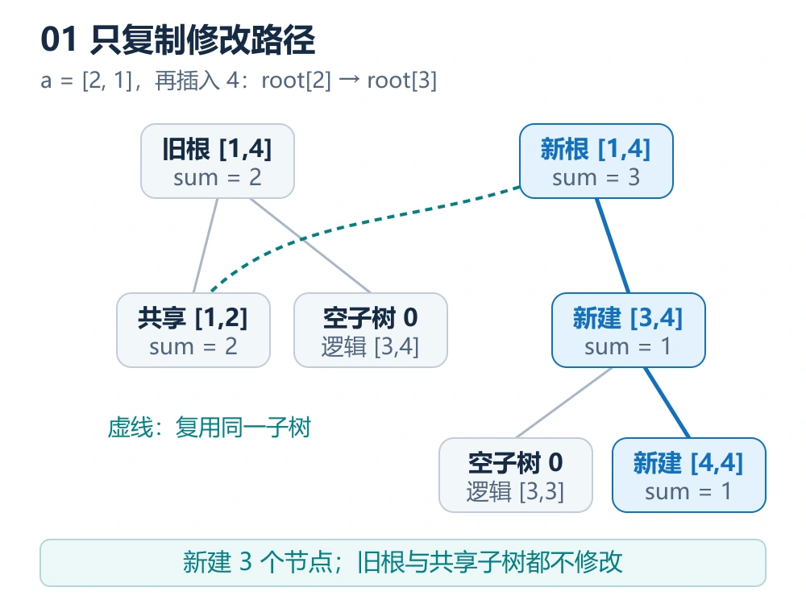
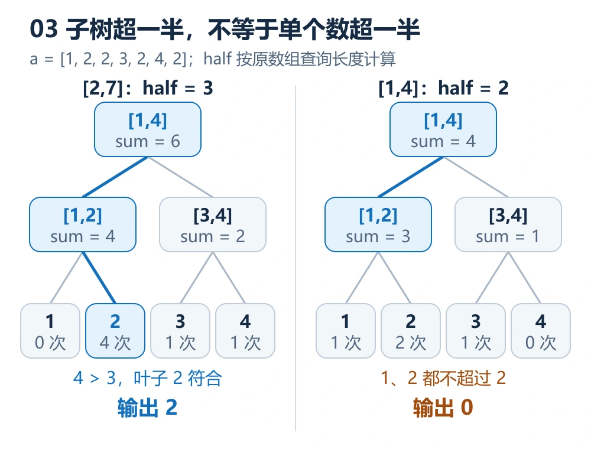

我学主席树时，已经接触过普通线段树。真正让我卡住的，是几个看起来很小的问题：节点里的 `sum` 是出现次数还是排名？开了几百万个节点，是不是就只能处理小于某个上限的数？为什么 `tr.push_back(tr[pre])` 就能保留历史版本？

这些问题在当时的学习聊天里都出现过，我也反馈过一次“RE 了”。这篇笔记把那次学习和三份 C++ 代码串起来：先弄清楚树里存什么，再理解版本怎么建立、查询怎么走，最后看严格多数和黑匣子两个应用。

**本文讲的是静态数组的前缀主席树：每个前缀保存一棵频次树，查询时取两个前缀的计数差。** 它可以在对数时间内求区间第 k 小，但这份模板不能直接处理原数组的任意修改。

> **先记住这四点**
>
> - 树按**数值或离散化排名**划分，`sum` 存**出现次数**。
> - 插入一个数，只复制一条根到叶子的路径，其他子树复用旧节点。
> - 区间 `[L,R]` 的频次来自 `root[R]` 与 `root[L-1]` 对应节点的计数差。
> - 第 k 小查询维护局部排名 `k`；严格多数查询维护固定阈值 `half`，两者不能混用。

## 1. 从普通线段树转到权值线段树

普通线段树常按数组下标划分；这里的权值线段树按**值域**划分。节点 `[1,2]` 表示数值 1 和 2 所在的一段值域，而不是原数组的前两个位置。

用学习聊天里的例子：

```text
a = [2, 1, 4, 3]
```

插入全部四个数后，根节点 `[1,4]` 的 `sum=4`，左子树 `[1,2]` 的 `sum=2`，右子树 `[3,4]` 的 `sum=2`。叶子 `[2,2]` 的 `sum=1`，因为数字 2 出现了一次。

这也是我当时第一个理解卡点。我问：“当前值域内出现了多少个数，是指排名吗？”现在可以用三个互不相同的量回答：

| 量 | 表示什么 | 例子 |
| --- | --- | --- |
| `pos` | 数字在离散化值域中的排名 | 原值 100 的排名可能是 2 |
| `sum` | 当前前缀中，落在节点值域里的元素数量 | 数字 100 出现三次，叶子计数就是 3 |
| `k` | 本次查询要找排序后的第几个元素 | 第 2 小对应 `k=2` |

**排名给数字找位置，计数记录这个位置出现了几次。** 如果数组是 `[100,100,100]`，离散化后只有一个排名，但叶子的 `sum` 是 3，查询第 1、2、3 小都应该得到 100。

这里的 `sum` 也不是数值之和。名字沿用了线段树模板，语义却是“频次总和”。

## 2. 路径复制：保留旧树，不复制整棵树

可持久化的核心是保留历史版本。对单点插入来说，只会改变根到目标叶子这一条路径，因此只需要复制路径上的节点；其余子树可以让多个版本共享。这个构造可对照 [OI Wiki 的可持久化线段树说明](https://oi-wiki.org/ds/persistent-seg/)。



图中已经插入 `[2,1]`，现在加入 4：

1. 新建根节点，计数从 2 变成 3。
2. 新建右子树 `[3,4]`，计数从 0 变成 1。
3. 新建叶子 `[4,4]`，计数从 0 变成 1。
4. 左子树 `[1,2]` 不受影响，新根仍指向原来的节点。

图中右侧旧值域的 0 表示逻辑上的空子树。动态开点时，不必真的建立整棵零树，用编号 0 的空节点代表它即可。

### 我当时没理解的两行代码

```cpp
int now = static_cast<int>(tr.size());
tr.push_back(tr[pre]);
```

`tr` 是节点池，里面装的是节点结构体；`now` 和 `pre` 都是**节点编号**。假设插入前 `tr.size()` 是 5，现有编号就是 0 到 4；追加一个节点后，它的编号正好是 5。

`push_back(tr[pre])` 把旧节点的 `ls`、`rs` 和 `sum` **复制到一个新节点**。随后只修改新节点的计数和发生变化的那个儿子，旧节点不动。

三个容器的职责也要分清：

| 容器 | 保存什么 |
| --- | --- |
| `a[i]` | 原数组第 i 个数 |
| `tr[id]` | 编号为 id 的节点，其字段包含左右儿子编号和计数 |
| `root[i]` | 前 i 个数对应的树根编号 |

`root[i]` 只是一个整数，不是把第 i 棵树的所有节点装进数组。所有版本的节点都存在同一个 `tr` 中，根编号决定从哪里开始访问。

## 3. 两个前缀版本相减，得到区间频次

定义 `root[i]` 保存前 i 个数的频次，就有：

$$
\operatorname{count}_{[L,R]}(V)
=\operatorname{count}_{[1,R]}(V)-\operatorname{count}_{[1,L-1]}(V)
$$

这里的 $V$ 可以是一个数字，也可以是一段值域。关键是：**两棵树要比较同一段值域的计数。**

以 `a=[2,1,4,3]` 为例，查询原数组 `[2,4]`，就是从前四个数中扣除第一个数，留下 `[1,4,3]`。对值域 `[1,2]`，两个前缀的计数分别是 2 和 1，因此查询区间里落在这一侧的元素有 `2-1=1` 个。

“两棵树相减”是一种简写。查询不会新建一棵差分树，也不会把两个根编号相减；它同时沿两棵树向下走，只在需要的节点上做 `sum` 的减法：

```cpp
int cntLeft = tr[tr[y].ls].sum - tr[tr[x].ls].sum;
```

初始时 `x=root[L-1]`，`y=root[R]`；递归进入子树以后，`x`、`y` 变成对应的子节点编号。

本文统一用大写 `L,R` 表示**原数组区间**，小写 `l,r` 表示**当前值域**。这两个区间恰好都写成左右端点，很容易在刚开始学习时混淆。

## 4. 第 k 小：向右走为什么要减去 cntLeft

查询第 k 小时，先统计左值域里有多少个元素。左边的所有值都小于右边的值，因此可以直接根据数量决定走向：

- 如果 `k <= cntLeft`，答案在左边，`k` 不变。
- 如果 `k > cntLeft`，答案在右边，新的局部排名是 `k-cntLeft`。

![区间 [2,4] 的第 2 小查询先进入右值域，将 k 从 2 改成 1，再进入叶子 3，得到答案 3。](./kth-query.webp)

查询 `[2,4]` 的第 2 小，区间内是 `[1,4,3]`。根节点的左值域 `[1,2]` 只有一个元素，所以第 2 小要去右边找。排除左侧这一个元素后，它变成右侧的第 `2-1=1` 小。

进入 `[3,4]` 后，左叶子 3 的计数是 1，当前 `k=1`，于是走左边，答案就是 3。

可以把递归中的 `k` 理解成：**当前值域内还要找第几个元素**。它不是始终保持原查询的排名。忘记右分支的 `k-cntLeft`，就等于已经排除了较小元素，却仍把它们算在排名里。

还有一个容易藏在文件名里的坑：我的模板文件名写的是“求区间第 k 大”，但代码先走小值所在的左子树，实际求的是**第 k 小**。若要查第 k 大，先转换成第 `R-L+2-k` 小即可。

## 5. 离散化与 C++17 完整模板

节点池大小限制的是节点数量，不是原数组的数值大小。静态数组可以先将所有数排序去重，把原值映射到 `[1,m]`；`m` 是不同数字的个数。

我当时问过“是不是规定数必须小于 `1e7`”。这个疑问其实把**原值、排名、节点编号**混在了一起。比如：

```text
原值：[-1000000000, 42, 1000000000, 42]
去重后的值表：[-1000000000, 42, 1000000000]
映射后的数组：[1, 2, 3, 2]
```

重复的 42 都映射到排名 2，但仍然插入两次。离散化只保留大小关系，不保留数值差距，因此适合第 k 小这种顺序查询。查询返回排名 `pos` 后，要用 `b[pos-1]` 还原原值。

下面是可独立编译的 **C++17** 模板，输入格式对应 [洛谷 P3834：静态区间第 k 小](https://www.luogu.com.cn/problem/P3834)。要求 `n>=1`，且每次查询满足 `1<=L<=R<=n`、`1<=k<=R-L+1`。节点编号和计数用 `int`，原值用 `long long`。

```cpp
#include <bits/stdc++.h>
using namespace std;

struct Node {
	int ls = 0;
	int rs = 0;
	int sum = 0;
};

vector<Node> tr(1); // 编号 0 代表计数为 0 的空子树
vector<int> root;

int update(int pre, int l, int r, int pos) {
	int now = static_cast<int>(tr.size());
	tr.push_back(tr[pre]);
	tr[now].sum++;

	if (l == r) return now;
	int mid = l + (r - l) / 2;

	// 先完成递归，再按编号访问节点，不跨递归保存引用。
	if (pos <= mid) {
		int child = update(tr[pre].ls, l, mid, pos);
		tr[now].ls = child;
	} else {
		int child = update(tr[pre].rs, mid + 1, r, pos);
		tr[now].rs = child;
	}
	return now;
}

int kth(int x, int y, int l, int r, int k) {
	if (l == r) return l;
	int mid = l + (r - l) / 2;
	int cntLeft = tr[tr[y].ls].sum - tr[tr[x].ls].sum;

	if (k <= cntLeft) {
		return kth(tr[x].ls, tr[y].ls, l, mid, k);
	}
	return kth(tr[x].rs, tr[y].rs, mid + 1, r, k - cntLeft);
}

int main() {
	ios::sync_with_stdio(false);
	cin.tie(nullptr);

	int n, q;
	cin >> n >> q;
	vector<long long> a(n + 1), b;
	for (int i = 1; i <= n; i++) {
		cin >> a[i];
		b.push_back(a[i]);
	}

	sort(b.begin(), b.end());
	b.erase(unique(b.begin(), b.end()), b.end());
	int m = static_cast<int>(b.size());

	// 最长根叶路径包含 ceil(log2(m)) + 1 个节点。
	int levels = 1;
	for (int width = m; width > 1; width = (width + 1) / 2) {
		levels++;
	}
	tr.reserve(1 + static_cast<size_t>(n) * levels);
	root.assign(n + 1, 0);

	for (int i = 1; i <= n; i++) {
		int pos = static_cast<int>(
			lower_bound(b.begin(), b.end(), a[i]) - b.begin()) + 1;
		root[i] = update(root[i - 1], 1, m, pos);
	}

	while (q--) {
		int L, R, k;
		cin >> L >> R >> k;
		int pos = kth(root[L - 1], root[R], 1, m, k);
		cout << b[pos - 1] << '\n';
	}
	return 0;
}
```

用这个自构造例子可以同时检查左右分支、重复值和单元素区间：

```text
输入：
5 4
2 1 4 3 2
2 4 2
1 5 3
3 3 1
1 5 5

输出：
3
2
4
4
```

复杂度来自树高。令 $h=1+\lceil\log_2 m\rceil$，一次插入至多新建 $h$ 个节点，一次查询至多访问 $h$ 层；用这个写法也能涵盖 `m=1` 的情况。

| 操作 | 复杂度 |
| --- | --- |
| 排序、去重及排名查找 | $O(n\log n)$ |
| 建立全部前缀版本 | $O(nh)$ |
| 一次第 k 小查询 | $O(h)$ |
| 节点池和根数组空间 | $O(nh)$ |

## 6. 严格多数：子树计数超一半，只代表值得继续找

[洛谷 P3567 KUR-Couriers](https://www.luogu.com.cn/problem/P3567) 查询的是区间中有没有一个数的出现次数**严格超过区间长度的一半**。这类数也常被称为绝对众数或严格多数元素。

它与一般众数不同。`[1,2,2,3]` 的一般众数是 2，但 2 只出现两次，没有严格超过四个元素的一半，因此本题应该输出 0。



用 `a=[1,2,2,3,2,4,2]` 比较两个区间：

| 查询 | `half` | 值域 `[1,2]` 的总计数 | 最终结果 |
| --- | --- | --- | --- |
| `[2,7]` | 3 | 4 | 数字 2 出现四次，答案为 2 |
| `[1,4]` | 2 | 3 | 1 出现一次，2 出现两次，答案为 0 |

第二行就是这个算法最值得想清楚的地方：子树里有三个元素，但它们可能属于多个不同的数字。**内部节点的总计数超一半，只是继续搜索的必要条件；叶子的计数才对应单个数字的出现次数。**

判断阈值始终是 `half=(R-L+1)/2`，不能按当前值域宽度重新计算，也不能像第 k 小那样在走右边时减去左边计数。

每层最多有一个子树的计数超过 `half`：左右值域不相交，如果两边都严格超过整个查询区间的一半，总次数就会超过区间长度。因此查询只走一条路径。

### 在模板中增加 majority 函数

插入过程与前面的模板相同，只需添加这个查询函数。返回值是离散化排名，0 表示不存在。

```cpp
int majority(int x, int y, int l, int r, int half) {
	if (l == r) {
		return tr[y].sum - tr[x].sum > half ? l : 0;
	}
	int mid = l + (r - l) / 2;
	int cntLeft = tr[tr[y].ls].sum - tr[tr[x].ls].sum;
	int cntRight = tr[tr[y].rs].sum - tr[tr[x].rs].sum;

	if (cntLeft > half) {
		return majority(tr[x].ls, tr[y].ls, l, mid, half);
	}
	if (cntRight > half) {
		return majority(tr[x].rs, tr[y].rs, mid + 1, r, half);
	}
	return 0;
}
```

将完整模板中 `while (q--)` 的查询循环替换为以下代码即可；其他读数组、离散化、建版本的部分不变：

```cpp
while (q--) {
	int L, R;
	cin >> L >> R;
	int half = (R - L + 1) / 2;
	int pos = majority(root[L - 1], root[R], 1, m, half);
	cout << (pos == 0 ? 0 : b[pos - 1]) << '\n';
}
```

P3567 的原值是正整数，所以用输出 0 表示不存在不会歧义。题面还保证 `a[i]<=n`，因此也可以直接用 `[1,n]` 建值域树，省略离散化；这里保留离散化是为了复用上一份模板。

我的原文件在叶子处直接返回 `l`。在合法非空查询中，如果从内部节点通过 `cnt>half` 才进入叶子，条件已得到保证；若整棵值域只有一个叶子，数组所有值相同，也一定有严格多数。因此不能仅凭这一行就断定原代码错误。笔记里的写法把叶子验证明确写出来，便于看清返回答案的条件。

另一个思路是先查询中位数，再统计候选值的次数。严格多数若存在，必然覆盖排序后的中间位置；**但中位数本身不一定是严格多数**，仍要验证频次。

## 7. 那次 RE：把容器风险和算法错误分开看

分享聊天里，我反馈过一次“RE 了”，当时的答复重点排查了动态 `vector` 扩容和 `#define int long long`。现在回头看，需要补上两个边界：**没有评测记录和编译标准，不能确定那次 RE 的唯一原因；后来提供的固定节点池版本，也不能直接套用动态扩容的诊断。**

### 扩容会让引用失效，但编号不会因此改变

`vector` 重新分配存储后，指向旧元素的引用、指针和迭代器会失效；这一点可对照 [C++ 标准草案的 vector 插入规定](https://eel.is/c++draft/vector.modifiers)。所以不要这样跨递归保存引用：

```cpp
// 错误示例：递归可能 push_back，并触发重新分配。
Node& current = tr[now];
int child = update(tr[pre].ls, l, mid, pos);
current.ls = child;
```

编号 `now` 仍是同一个整数，递归结束后重新通过 `tr[now]` 访问即可。前面模板先把子节点编号存入局部变量，再写回父节点，就是为了不跨递归持有元素引用。

这里也不能把下面这一行一概判错：

```cpp
tr[now].ls = update(tr[pre].ls, l, mid, pos);
```

**C++17 已规定赋值右侧先于左侧求值**，对应规则见 [C++ 标准草案的赋值表达式条款](https://eel.is/c++draft/expr.assign)。在这个表达式里，右侧递归结束后才求值左侧，不会因为“提前拿到左侧引用”而产生同一风险。旧标准下不能依赖这一顺序。把两步分开写，更清楚，也不需要读者记住这条求值规则。

而 `vector<Node> tr(40*N)` 已经创建了这么多节点，通过编号赋值的 `update()` 没有 `push_back`，不会在递归中自动扩容。它需要检查的是 `tot` 有没有越过池边界，而不是动态扩容导致引用失效。

### 全部改成 long long，内存也会一起翻倍

我的原代码使用了 `#define int long long`。在常见竞赛平台上，三个 32 位整数字段的节点通常占 12 字节，换成三个 64 位字段后通常占 24 字节。具体布局应以目标环境的 `sizeof(Node)` 为准。

按原模板的 `N=200005`、节点池 `40*N` 计算，**仅节点元素区**就约为：

```text
40 × 200005 × 24 = 192004800 字节，约 183.1 MiB
40 × 200005 × 12 =  96002400 字节，约  91.6 MiB
```

这不是实测峰值，还没有计算根数组、输入数组、离散化数组和容器开销。P3567 那份代码用 `20*N`、`N=500005`，若每个节点 24 字节，仅节点区就约 228.9 MiB。

节点计数不超过 `n`，节点编号则取决于实际节点总数；在本文两道题的数据范围和路径复制构造下，它们可以使用 32 位整数。原值是否需要 `long long`，应单独判断。不要因为数值可能大，就把儿子编号和计数全部扩大。

### reserve 和 resize 不能互换

`reserve` 预留容量，不创建可下标访问的元素；`resize` 或构造函数带大小，才改变 `size()`。这个区别可对照 [C++ 标准草案的 vector 容量条款](https://eel.is/c++draft/vector.capacity)。

- 动态追加写法：`vector<Node> tr(1)`，用 `push_back` 创建节点，可以先 `reserve` 减少扩容。
- 固定节点池写法：`vector<Node> tr(capacity)`，用 `++tot` 分配编号，必须确保编号没有越界。

这两套分配方式不要混搭。只 `reserve` 以后就写 `tr[++tot]`，访问的元素可能根本不存在；反过来，先创建几百万个元素，再以 `tr.size()` 作为新编号追加，又会跳过原本想使用的池子。

我现在会按这个顺序排查：节点编号是否越界、`root` 是否覆盖输入规模、查询的 `k` 是否合法、容器是否跨递归保存引用、内存估算是否超过题目限制。它们是检查方向，不能替代具体的错误记录。

## 8. 黑匣子：主席树能做，也要看是否需要历史版本

[洛谷 P1801 黑匣子](https://www.luogu.com.cn/problem/P1801) 的第 i 次 `GET`，查询前 `u[i]` 个数中的第 i 小，且 `u` 单调不降。用主席树就是：

```cpp
int pos = kth(root[0], root[u[i]], 1, m, i);
cout << b[pos - 1] << '\n';
```

这很适合复习前缀版本，但这道题也能利用查询顺序做得更直接：维护两个堆，左边的大根堆保存当前最小的 k 个元素，右边的小根堆保存其余元素。

始终维持两个不变量：

1. 左边所有元素都不大于右边所有元素。
2. 回答第 k 小之前，左边恰好有 k 个元素。

于是左堆顶就是第 k 小。我的原代码用两个 `multiset` 实现相同的分区思想，`ph(k)` 调整大小；它并不是字面上的两个 `priority_queue`，但两边的顺序与大小约束相同。

下面给出 P1801 的独立 C++17 对顶堆写法，保留单调查询带来的优势：

```cpp
#include <bits/stdc++.h>
using namespace std;

int main() {
	ios::sync_with_stdio(false);
	cin.tie(nullptr);

	int n, q;
	cin >> n >> q;
	vector<long long> a(n + 1);
	for (int i = 1; i <= n; i++) cin >> a[i];

	priority_queue<long long> down;
	priority_queue<long long, vector<long long>, greater<long long>> up;
	int inserted = 0;

	for (int k = 1; k <= q; k++) {
		int u;
		cin >> u;
		while (inserted < u) {
			long long value = a[++inserted];
			if (down.empty() || value <= down.top()) down.push(value);
			else up.push(value);
		}
		while (down.size() > static_cast<size_t>(k)) {
			up.push(down.top());
			down.pop();
		}
		while (down.size() < static_cast<size_t>(k)) {
			down.push(up.top());
			up.pop();
		}
		cout << down.top() << '\n';
	}
	return 0;
}
```

合法输入保证 `u>=k`，因此平衡时不会要求从空的右堆取元素。同一前缀可以连续查询多次，`k` 每次加一，堆也随之调整。

在这道题的单调前缀与单调排名条件下，每个新元素只需插入和必要的跨堆移动，总时间为 $O((n+q)\log n)$，空间为 $O(n)$。不能把这个结论照搬到任意顺序、任意排名的查询：来回大幅调整 k，可能需要反复搬动大量元素。

| 需求 | 本文前缀主席树 | 本文对顶堆写法 |
| --- | --- | --- |
| 静态数组任意 `[L,R]` 的第 k 小 | 两个前缀计数相减 | 不能直接支持 |
| 黑匣子中的单调前缀查询 | 可以 | 可以，额外存储更少 |
| 查询历史前缀 | 保留根编号即可访问 | 仅维护当前状态 |
| 原数组任意修改后的区间查询 | 这份静态模板不能直接支持 | 这份插入模板也不能直接支持 |

学会一个新结构后，很容易把能做的题都往它身上套。黑匣子提醒我先看题目需要保留哪些状态：只维护当前前缀，就未必需要全部历史版本；需要任意区间频次差，前缀主席树的作用才体现出来。

## 9. 再练时，带着这些问题检查模板

我准备按“第 k 小 → 黑匣子 → 严格多数”的顺序复习。每做一道题，先回答下面几件事，再写递归：

- 当前 `[l,r]` 是下标区间还是值域？
- `sum` 是频次、数值和，还是其他信息？
- `root[i]` 保存什么历史状态？
- 左右版本能不能对同一值域做计数差？
- 进入右侧时，变化的是局部排名 `k`，还是应保持不变的阈值 `half`？

**建版本时复制路径、保存新根；查区间时比较两个前缀的频次差。** 这两件事想清楚以后，第 k 小与严格多数的区别就落在查询条件上，而不是重新背一整份模板。

*本文由 [bingqilin456](/about/) 整理，依据[当时的主席树学习聊天](https://chatgpt.com/share/6ac873b7-e578-83ec-8e6a-cdfe6433b03e)与三份个人 C++ 笔记撰写，题意和语言规则于 2026 年 10 月 9 日核对。文中的第 k 小程序、按说明改造的严格多数程序和对顶堆程序已在本机以 C++17 编译，通过文中对应示例及每套 120 组随机数据与朴素算法的对照；这不等同于线上评测通过。封面为 AI 概念插图，正文三张图为按本文例子绘制的原理示意图。RE 分析是复盘排查方向，并未复现当时的评测环境。*
