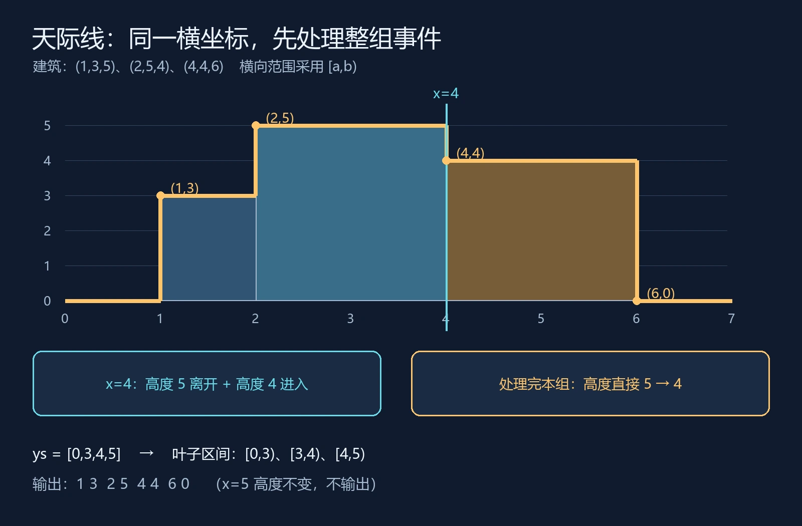

这次把三份 C++ 笔记放在一起整理：主席树求区间顺序统计、扫描线求天际线，以及离线排序配合树状数组做二维数点。

它们的代码长得很不一样，却都可以从同一个问题入手：**按什么顺序处理数据，当前结构里保存什么，怎样从这个状态得到答案？** 主席树保存各个前缀的频次，天际线维护当前有效建筑的高度覆盖，离线数点维护满足当前阈值的位置。

这篇沿着这条线复盘，不把三个模板当成三个独立的背诵任务。默认已经了解递归、排序和前缀和；文中的完整代码使用 C++17，输入规模和合法性按对应题面约定。

> **先记住这四点**
>
> - 主席树按值域组织节点，保存数组前缀的频次版本，区间查询取两个版本的计数差。
> - 扫描线按事件顺序推进，数据结构维护当前截面；同一坐标的事件处理完，再观察结果。
> - 离线二维数点按数值阈值扫描，树状数组按原数组下标维护计数。
> - 离散化用于排名时保留大小关系；用于覆盖长度时，必须保留坐标之间的真实距离。

## 1. 先问树里存什么，再看 update 怎么写

三份模板最容易混淆的地方，是都出现了区间、节点和计数，但它们描述的是不同维度。

| 方法 | 按什么顺序推进 | 结构按什么划分 | 节点或状态保存什么 |
| --- | --- | --- | --- |
| 前缀主席树 | 原数组下标 `i` | 数值的离散化排名 | 前 `i` 个元素在某段值域里的出现次数 |
| 天际线扫描线 | 建筑端点的横坐标 `x` | 相邻高度坐标形成的区间 | 完整覆盖次数与实际覆盖长度 |
| 离线排序 + 树状数组 | 查询阈值 `x` | 原数组下标 | 哪些位置的值已经满足 `a[i] <= x` |

例如 `a=[5,1,4,2,3]`。主席树插入第一个元素时，走的是值 5 所在的叶子；离线数点在阈值升到 1 时，激活的却是原数组的第 2 个位置。

**同样是“插入一个数”，主席树插入的是值域频次，树状数组标记的是原位置。** 如果这一步没分清，后面即使记住了 `query(r)-query(l-1)`，也很容易减错对象。

扫描线是一种处理顺序，线段树和树状数组是维护状态的工具。它们可以组合使用，但不是同一个层级的概念。

## 2. 主席树：把前缀频次保存下来

这份主席树模板处理的是静态数组。建立 `root[i]`，表示前 `i` 个元素的频次树；插入第 `i` 个数时，只复制根到目标叶子的路径，没变化的子树继续共享。路径复制的构造可对照 [OI Wiki 的可持久化线段树说明](https://oi-wiki.org/ds/persistent-seg/)。

之前的[主席树学习笔记：从区间第 k 小到严格多数查询](/posts/persistent-segment-tree-kth-majority/)已经详细展开过路径复制、节点池和内存。这次重点看它怎样与“按顺序维护状态”的思路接上。

### 两个根表示同一区间的两端

对于查询 `[L,R]`，任意一段值域 `V` 的元素数量都可以写成：

$$
\operatorname{count}_{[L,R]}(V)
=\operatorname{count}_{[1,R]}(V)-\operatorname{count}_{[1,L-1]}(V)
$$

因此查询拿的是 `root[R]` 和 `root[L-1]`。不是把两个根编号相减，也不需要建立一棵新树；沿两棵树的对应节点向下走，需要数量时，再做频次相减。

![数组 [5,1,4,2,3] 查询 [2,5] 的第 3 小：先进入 [1,3]，其中左侧 [1,2] 有两个元素，进入右叶子后 k 变成 1，得到 3。](./persistent-query.webp)

例子中 `[2,5]` 包含 `[1,4,2,3]`，排序后是 `[1,2,3,4]`。根的左值域 `[1,3]` 有三个元素，所以第 3 小先走左侧；在 `[1,3]` 的左值域 `[1,2]` 中只有两个元素，于是进入右叶子 3，局部排名变成 `3-2=1`。

每次分支都在回答同一个问题：**左侧已经占了多少个排名？** 如果 `k` 没超出这些排名，继续向左；否则排除它们，向右查第 `k-cntLeft` 小。

### 文件名写“第 k 大”，代码实际求“第 k 小”

原文件名是“求区间第 k 大”，但查询先统计左侧小值的数量，实现实际求第 k 小。对于长度为 `len` 的区间，第 k 大对应第 `len-k+1` 小：

```cpp
int kthSmall = R - L + 2 - k;
int pos = kth(root[L - 1], root[R], 1, m, kthSmall);
```

下面的完整模板统一使用第 k 小语义，输入格式对应[洛谷 P3834 静态区间第 k 小](https://www.luogu.com.cn/problem/P3834)。要求 `n>=1`，查询满足 `1<=L<=R<=n` 且 `1<=k<=R-L+1`。

### C++17 完整模板：静态区间第 k 小

```cpp
#include <bits/stdc++.h>
using namespace std;

struct Node {
	int ls = 0, rs = 0, sum = 0;
};

vector<Node> tr;
vector<int> root;
int tot = 0;

int update(int pre, int l, int r, int pos) {
	int now = ++tot;
	tr[now] = tr[pre];
	tr[now].sum++;
	if (l == r) return now;
	int mid = l + (r - l) / 2;
	if (pos <= mid) {
		tr[now].ls = update(tr[pre].ls, l, mid, pos);
	} else {
		tr[now].rs = update(tr[pre].rs, mid + 1, r, pos);
	}
	return now;
}

int kth(int x, int y, int l, int r, int k) {
	if (l == r) return l;
	int mid = l + (r - l) / 2;
	int cntLeft = tr[tr[y].ls].sum - tr[tr[x].ls].sum;
	if (k <= cntLeft) {
		return kth(tr[x].ls, tr[y].ls, l, mid, k);
	}
	return kth(tr[x].rs, tr[y].rs, mid + 1, r, k - cntLeft);
}

int main() {
	ios::sync_with_stdio(false);
	cin.tie(nullptr);
	int n, q;
	cin >> n >> q;
	vector<long long> a(n + 1), b;
	for (int i = 1; i <= n; i++) {
		cin >> a[i];
		b.push_back(a[i]);
	}
	sort(b.begin(), b.end());
	b.erase(unique(b.begin(), b.end()), b.end());
	int m = static_cast<int>(b.size());

	// 每次插入只分配一条路径，按最长路径预先创建节点池。
	int levels = 1;
	for (int width = m; width > 1; width = (width + 1) / 2) {
		levels++;
	}
	tr.resize(1 + static_cast<size_t>(n) * levels);
	root.assign(n + 1, 0);
	for (int i = 1; i <= n; i++) {
		int pos = static_cast<int>(
			lower_bound(b.begin(), b.end(), a[i]) - b.begin()) + 1;
		root[i] = update(root[i - 1], 1, m, pos);
	}
	while (q--) {
		int L, R, k;
		cin >> L >> R >> k;
		int pos = kth(root[L - 1], root[R], 1, m, k);
		cout << b[pos - 1] << '\n';
	}
}
```

`tr[0]` 是全零空节点。原笔记使用 `25*N` 的固定池，这里仍按编号分配，但把容量改成由 `n` 和最大路径层数计算，避免不必要的大池子。`resize` 创建元素，不能替换成只预留容量的 `reserve` 后继续下标赋值。

原值用 `long long`，节点编号和频次用 `int`，不再整体使用 `#define int long long`。令不同值个数为 `m`、最大路径层数为 `h=1+ceil(log2(m))`，建版本用时 `O(nh)`，单次查询 `O(h)`，节点空间 `O(nh)`，离散化另外需要 `O(n log n)`。

这份模板保存的是**静态数组的前缀版本**。保留版本并不等于支持原数组任意位置修改；动态修改区间顺序统计需要另外设计。

## 3. 天际线：扫描横坐标，维护高度覆盖

[洛谷 P1904 天际线](https://www.luogu.com.cn/problem/P1904)用三元组 `(a,h,b)` 描述建筑：左端点、高度、右端点，输入直到 EOF。目标是输出轮廓发生变化的位置与新高度。

每栋建筑拆成两个事件：

- 在 `a` 处进入，给高度区间 `[0,h)` 增加一次覆盖。
- 在 `b` 处离开，给同一个区间减少一次覆盖。

按横坐标排序后处理这些事件，就知道当前哪些建筑仍然有效。这里把建筑的水平范围统一解释为 `[a,b)`，在同一横坐标处理完所有进入和离开后，状态对应向右的一段截面。

### 为什么覆盖长度等于最高高度

因为所有建筑都落在同一条地面上，当前高度区间形如 `[0,h)`，它们的并集必然还是从 0 开始的连续区间：

$$
[0,h_1)\cup[0,h_2)\cup\cdots=[0,\max(h_1,h_2,\ldots))
$$

所以并集长度就是最高高度。这里维护覆盖长度，不是在累加建筑高度，也不是直接维护所有高度的和。



使用三栋建筑 `(1,3,5)`、`(2,5,4)`、`(4,4,6)`，事件分组后得到：

| 横坐标 | 本组事件 | 本组处理后高度 | 是否输出 |
| --- | --- | --- | --- |
| 1 | 高度 3 进入 | 3 | `(1,3)` |
| 2 | 高度 5 进入 | 5 | `(2,5)` |
| 4 | 高度 5 离开，高度 4 进入 | 4 | `(4,4)` |
| 5 | 高度 3 离开 | 4 | 否 |
| 6 | 高度 4 离开 | 0 | `(6,0)` |

如果在 `x=4` 每处理一个事件就输出一次，可能先看到临时高度 3，再看到高度 4。这只是同一坐标内部的处理中间态，不是天际线的一段。因此要先处理整组，再比较 `cur`。这一思路也符合[扫描线按事件维护截面状态的解释](https://oi-wiki.org/geometry/scanning/)。

### 离散化的叶子是小区间，不是坐标点

收集 `0` 和所有建筑高度，排序去重得到：

```text
ys = [0, 3, 4, 5]

叶子 0 → [0,3)，长度 3
叶子 1 → [3,4)，长度 1
叶子 2 → [4,5)，长度 1
```

如果一共有 `ys.size()` 个高度坐标，只有 `ys.size()-1` 个相邻小区间。节点管理叶子编号 `[l,r]`，对应真实高度范围 `[ys[l],ys[r+1])`，完整长度必须写成 `ys[r+1]-ys[l]`。

高度 `h` 在坐标表中的编号为 `id`，那么 `[0,h)` 覆盖的叶子就是 `[0,id-1]`。一个右端点是 `id-1`，另一个长度计算是 `r+1`，它们都来自“叶子代表相邻坐标之间的区间”。

### cover 与 len，以及为什么不用 pushdown

`cover` 记录完整覆盖当前节点区间的建筑数量；`len` 记录该节点区间内被至少一栋建筑覆盖的真实长度。

```text
cover > 0  → len = ys[r+1] - ys[l]
cover == 0 且是叶子 → len = 0
cover == 0 且不是叶子 → len = 左儿子长度 + 右儿子长度
```

父节点完整覆盖时，子节点自己的覆盖信息仍保留。父节点的覆盖消失后，重新合并子节点，就能恢复剩下建筑的覆盖情况。

不需要 `pushdown` 的前提是：进入和离开更新同一段高度范围，在线段树里分解到同一批节点；`cover` 保存的是这种完整覆盖的计数。**这不是普通区间加法线段树的通用替代写法。**

### C++17 完整模板：P1904 天际线

题面保证至少一栋建筑、高度为正、端点合法。`m` 表示离散化后的小区间数量。

```cpp
#include <bits/stdc++.h>
using namespace std;

struct Node {
	int cover = 0;
	long long len = 0;
};
struct Event {
	long long x, h;
	int delta;
};
vector<Node> tr;
vector<long long> ys;

void pushup(int rt, int l, int r) {
	if (tr[rt].cover > 0) {
		tr[rt].len = ys[r + 1] - ys[l];
	} else if (l == r) {
		tr[rt].len = 0;
	} else {
		tr[rt].len = tr[rt * 2].len + tr[rt * 2 + 1].len;
	}
}

void update(int rt, int l, int r, int ul, int ur, int delta) {
	if (ur < l || r < ul) return;
	if (ul <= l && r <= ur) {
		tr[rt].cover += delta;
		pushup(rt, l, r);
		return;
	}
	int mid = l + (r - l) / 2;
	update(rt * 2, l, mid, ul, ur, delta);
	update(rt * 2 + 1, mid + 1, r, ul, ur, delta);
	pushup(rt, l, r);
}

int main() {
	ios::sync_with_stdio(false);
	cin.tie(nullptr);
	vector<Event> events;
	long long a, h, b;
	ys.push_back(0);
	while (cin >> a >> h >> b) {
		events.push_back({a, h, 1});
		events.push_back({b, h, -1});
		ys.push_back(h);
	}
	sort(events.begin(), events.end(), [](const Event& u, const Event& v) {
		return u.x < v.x;
	});
	sort(ys.begin(), ys.end());
	ys.erase(unique(ys.begin(), ys.end()), ys.end());
	int m = static_cast<int>(ys.size()) - 1;
	tr.resize(4 * m + 5);
	long long cur = 0;
	bool first = true;
	for (size_t i = 0; i < events.size();) {
		long long x = events[i].x;
		while (i < events.size() && events[i].x == x) {
			int id = static_cast<int>(
				lower_bound(ys.begin(), ys.end(), events[i].h) - ys.begin());
			update(1, 0, m - 1, 0, id - 1, events[i].delta);
			i++;
		}
		if (tr[1].len != cur) {
			if (!first) cout << ' ';
			cout << x << ' ' << tr[1].len;
			first = false;
		}
		cur = tr[1].len;
	}
	cout << '\n';
}
```

若建筑数量为 `B`，有 `2B` 个事件。排序与更新的总时间为 `O(B log B)`，高度线段树和事件数组用 `O(B)` 空间。天际线只需要当前截面的状态，无须保存所有历史版本。

如果题目变成一般矩形面积并，就不能把覆盖长度叫作最高高度了：纵向区间可能从不同位置开始，此时覆盖长度乘相邻横坐标之差，才得到对应竖条的并集面积。

## 4. 离线二维数点：扫描值，维护位置

[洛谷 P10814 离线二维数点](https://www.luogu.com.cn/problem/P10814)每次询问 `(L,R,x)`，统计原数组 `[L,R]` 中值小于等于 `x` 的元素个数。

把每个元素看作平面上的点 `(i,a[i])`，查询就是数出位于 `L<=i<=R`、`a[i]<=x` 这一区域内的点。这里有两个维度：原数组位置，以及数值大小。

暴力对每个询问都扫描区间，会反复比较相同的值。离线处理则把全部询问先读入，按阈值从小到大排序，让“符合条件的元素集合”只增加、不减少。

### 两次排序解决一维，树状数组解决另一维

具体步骤是：

1. 数组元素保存 `(val,pos)`，按 `val` 升序排列，保留原下标 `pos`。
2. 询问保存 `(L,R,x,id)`，按 `x` 升序排列，保留原询问编号 `id`。
3. 用指针 `cur` 逐个加入所有 `val<=x` 的元素，在树状数组中执行 `add(pos,1)`。
4. 用 `prefix(R)-prefix(L-1)` 得到位置区间中的已激活数量。
5. 答案写入 `ans[id]`，最后按原编号输出。

![数组 [5,1,4,2,3] 在阈值 x=3 时激活原下标 2、4、5；树状数组中的逻辑标记为 [0,1,0,1,1]，区间 [2,5] 的计数为 3。](./offline-fenwick.webp)

以 `a=[5,1,4,2,3]` 为例，处理阈值 `x=3` 时，值 1、2、3 已经加入，它们对应的原下标分别为 2、4、5。

```text
原下标：  1  2  3  4  5
原数组：  5  1  4  2  3
逻辑标记：0  1  0  1  1

查询 [2,5] 且值 <=3：prefix(5) - prefix(1) = 3 - 0 = 3
```

图中的 0/1 行是便于理解的逻辑标记。树状数组内部不是原样存这行数据，而是在 `bit[i]` 中保存区间 `[i-lowbit(i)+1,i]` 的累计计数。`lowbit` 和前缀查询的结构可对照 [OI Wiki 的树状数组说明](https://oi-wiki.org/ds/fenwick/)。

当阈值继续增加，指针接着向前走，已经加入的元素不需要重新插入。每个元素至多加入一次，这就是排序改变处理顺序带来的收益。

### 小于等于、原下标、原询问编号

题目要求 `<=x`，所以必须在回答前把所有与 `x` 相等的值也加入。如果误写成 `<x`，重复值和边界值会漏算。

元素排序后，新位置只用于推进 `cur`；`add` 用的是保存下来的原下标，而不是排序后的序号。询问同理，排序顺序只决定处理先后，输出顺序仍由 `id` 决定。

这份做法没有对 `val` 离散化，因为 `val` 只参与比较与排序；树状数组的下标本来就是 `[1,n]`。如果维护的数据结构改为按数值索引，才需要重新考虑值域压缩。

### C++17 完整模板：P10814 离线二维数点

```cpp
#include <bits/stdc++.h>
using namespace std;

struct Element {
	long long val;
	int pos;
};
struct Query {
	int l, r, id;
	long long x;
};

int n;
vector<int> bit;

void add(int pos) {
	for (int i = pos; i <= n; i += i & -i) {
		bit[i]++;
	}
}

int prefix(int pos) {
	int res = 0;
	for (int i = pos; i > 0; i -= i & -i) {
		res += bit[i];
	}
	return res;
}

int main() {
	ios::sync_with_stdio(false);
	cin.tie(nullptr);
	int q;
	cin >> n >> q;
	vector<Element> a(n);
	for (int i = 0; i < n; i++) {
		cin >> a[i].val;
		a[i].pos = i + 1;
	}
	vector<Query> queries(q);
	for (int i = 0; i < q; i++) {
		cin >> queries[i].l >> queries[i].r >> queries[i].x;
		queries[i].id = i;
	}
	sort(a.begin(), a.end(), [](const Element& u, const Element& v) {
		return u.val < v.val;
	});
	sort(queries.begin(), queries.end(), [](const Query& u, const Query& v) {
		return u.x < v.x;
	});
	bit.assign(n + 1, 0);
	vector<int> ans(q);
	int cur = 0;
	for (const Query& query : queries) {
		while (cur < n && a[cur].val <= query.x) {
			add(a[cur].pos);
			cur++;
		}
		ans[query.id] = prefix(query.r) - prefix(query.l - 1);
	}
	for (int value : ans) cout << value << '\n';
}
```

原笔记的核心流程就是这套做法。整理时去掉了无关宏，修正多余的 `*/`，并把树状数组更新上界从固定容量改为实际的 `n`。排序采用接收 `const` 引用的比较函数。

数组排序需要 `O(n log n)`，询问排序需要 `O(q log q)`，加入元素与查询需要 `O((n+q) log n)`，总体可写作 `O((n+q) log(n+q))`，空间为 `O(n+q)`。

“离线”的限制也要一起记住：必须先知道全部询问，才能重新排序。如果下一条询问依赖上一条答案解码，不能直接套这份模板。

## 5. 主席树与离线扫描，其实在拆同样的两个维度

现在再回看数组问题，会发现两个做法都在处理“位置 + 数值”，只是选择了不同的推进方向。

**主席树沿原位置推进，把值域频次保存为历史版本。** 所以可以取任意两个前缀的差，求 `[L,R]` 的频次分布，再直接沿树查第 k 小。查询顺序可以任意，但数组仍是静态的。

**离线数点沿数值阈值推进，把原位置是否满足条件存入树状数组。** 所以每个查询只需要一次位置区间计数；它只保存当前状态，换来的代价是必须先排序询问。

从计数角度说，第 k 小就是最小的、使区间中 `<=v` 的数量达到 `k` 的值 `v`。但不能因此把二维数点模板直接改个查询函数就叫主席树：单个阈值的扫描状态，没有保存任意值域分布的历史查询能力。

| 问题或条件 | 本文对应做法 | 使用边界 |
| --- | --- | --- |
| 静态数组区间第 k 小 | 前缀主席树 | 按值域分支，重复元素按频次计入 |
| 全部询问已知，统计 `[L,R]` 内 `<=x` 的数量 | 离线排序 + 树状数组 | 允许重排询问，再按 `id` 还原输出 |
| 建筑轮廓在哪些横坐标变化 | 事件扫描 + 覆盖长度线段树 | 建筑都从同一地面开始，事件按坐标分组 |
| 原数组存在任意位置修改 | 不能直接照搬本文数组模板 | 修改会破坏预建版本或静态排序的前提 |

### 两种离散化，别把长度压成排名

主席树中的 `b=[10,100,1000]` 可以映射为 `[1,2,3]`，因为第 k 小只关心顺序。

但高度坐标 `ys=[0,3,100]` 中的两段长度是 3 和 97，不能都按一个叶子算成长度 1。**排名说明坐标在哪里，原坐标差说明区间有多长。** 保留坐标表不是为了最后还原一个答案，而是每次 `pushup` 都要使用它。

这个区别比记住某一行 `lower_bound` 更值得记：离散化保留了顺序，却没有自动保留距离。

## 6. 用小例子检查状态是否符合预期

完整模板可以分别复制为三个 `.cpp` 文件，使用 C++17 编译。下面是本文自构造的例子，不是题面官方样例。

### 区间第 k 小：走向与重复值

```text
输入：
5 4
5 1 4 2 3
2 5 3
1 5 1
1 5 5
3 3 1

输出：
3
1
5
4
```

再用全相等数组 `[7,7,7]` 检查 `m=1`：第 1 小和第 3 小都应该输出 7。这里有三个元素，但只有一个不同值，叶子频次应该为 3。

### 天际线：同坐标事件与不变的高度

```text
输入（随后结束输入）：
1 3 5
2 5 4
4 4 6

输出：
1 3 2 5 4 4 6 0
```

注意 `x=5` 不输出，低建筑离开不改变最高高度。再考虑两栋同高、首尾相接的建筑 `(1,3,2)` 与 `(2,3,4)`：应该只输出 `1 3 4 0`，不能在 `x=2` 人为插入一个降到 0 的折点。

### 离线数点：查询顺序与等号边界

```text
输入：
5 4
5 1 4 2 3
2 5 3
1 5 5
1 3 1
3 5 2

输出：
3
5
1
1
```

原询问的阈值依次是 `3,5,1,2`，算法实际按 `1,2,3,5` 处理，输出仍要恢复原顺序。最后一条查询要把值恰好等于 2 的元素算进去。

## 7. 这次整理后，我想保留的复盘顺序

以后再看到带树的模板，我会先写清楚“一个叶子代表什么”：是一个值、一个原下标，还是两个坐标之间的一段长度。然后说明整个结构在当前时刻代表什么，再检查更新是否保持了这个含义。

最后才看查询：主席树取两个前缀频次的差，天际线读根节点的覆盖长度，离线数点取位置前缀计数的差。三个答案看起来都很短，但都建立在前面的状态定义上。

这比把 `update` 和 `query` 背下来更方便复习。只要能解释维护状态为什么正确，再沿着一个小例子走一遍，代码里 `L-1`、`id-1`、`r+1` 和 `k-cntLeft` 的来源就不再是孤立的细节。

继续复习路径复制与严格多数查询，可以回到[前一篇主席树学习笔记](/posts/persistent-segment-tree-kth-majority/)；想练习本文两种扫描顺序，可以分别做 [P1904 天际线](https://www.luogu.com.cn/problem/P1904)和 [P10814 离线二维数点](https://www.luogu.com.cn/problem/P10814)。

*本文根据三份本地 C++ 算法笔记整理。封面为 AI 生成的概念插画，正文三张图为按示例数据绘制的算法示意图；没有使用插画推导查询结果。*
